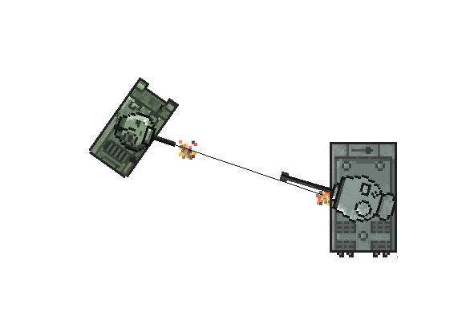
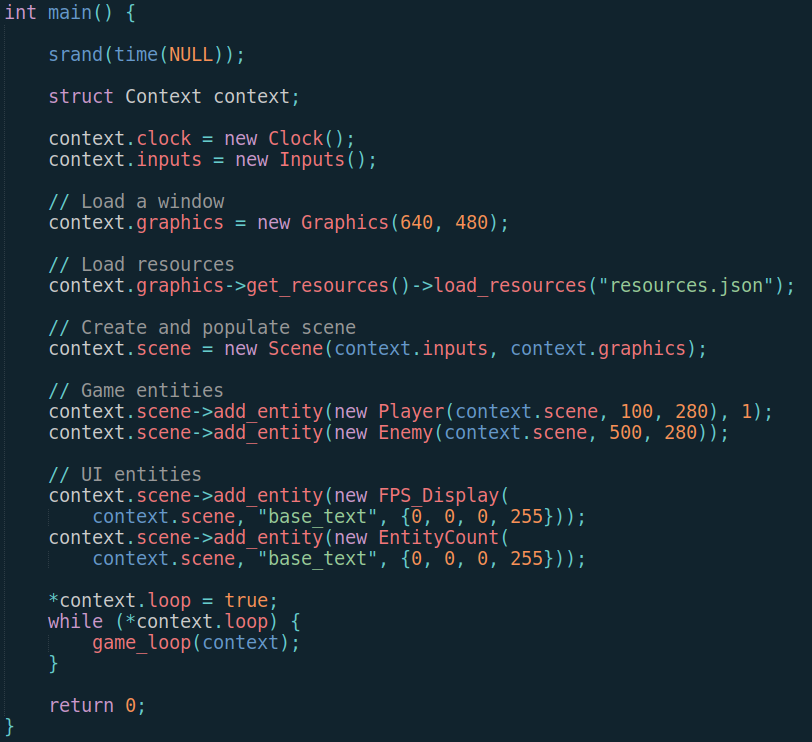
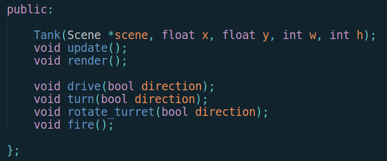
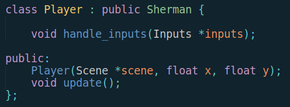
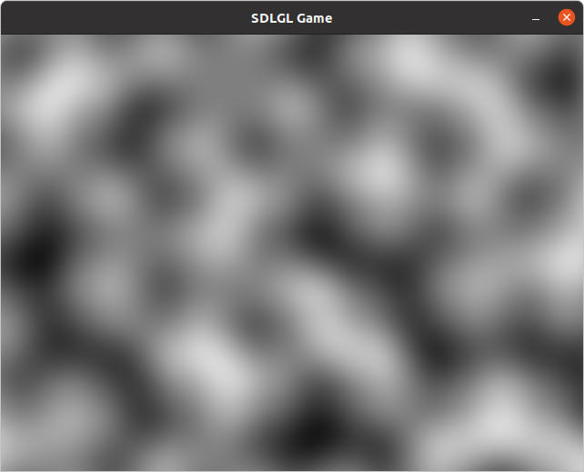

# CS 378: Top Down Tank Game
Grayson Pike, McCray Robertson, Jack Su

[Video Trailer](https://drive.google.com/file/d/1YP4eQrjQx3UrjiTRJoWBWxoLTid3J4Jx/view)

### Game Design
Our final project is a single player top-down arcade-style tank combat game. The player drives a tank around a map with an enemy (AI controlled) tank, and must shoot the enemy to destroy it. Particle effects are used to show explosions when firing the tank’s cannon or hitting the enemy tank.

The player drives the tank with the WASD keys, and rotates the turret using the arrow keys. The tank drives realistically, with turning mechanics for forward and reverse driving. The space bar fires the gun, which takes 3 seconds to reload. The enemy tank will rotate its turret towards the player, and has a slow turret speed. This allows the player to avoid being hit with evasive driving.

### Technical Architecture
Our game is written in C++ using SDLGL, which is a game library developed by Grayson. The library is written for performance and simplicity, and implements the following features:

- Scene and entity organization
- JSON-defined resources manifest and manager
- Graphics abstractions for textures, animated sprites, fonts, and particle effects
- Multi-channel audio mixing for sounds and music
- UI Elements
- Utility functions for noise generation and game math

Our game uses polymorphism and inheritance to structure its entity classes. At the root of the inheritance tree is the Tank class, which defines logic for driving, controlling the turret, and firing the gun. The two types of tanks, Sherman and Tiger, each inherit from this abstract class, and define model-specific features of the tanks like textures, sounds, hitbox size, etc.

Finally, the Player and Enemy classes inherit from the Sherman and Tiger classes to provide control logic. The Player class listens to keyboard inputs to drive itself and the Enemy has a basic AI to control the tank.

Other classes, such as explosion effects, firing effects, and UI elements are children of library-provided base classes from the particle system and UI system respectively.

During the course of this project, two major systems that we implemented were particle effects and Perlin noise generation.

### Responsibilities
Grayson handled programming closely related to his game library. We pair programmed all together to implement the more complex features, like Perlin noise. McCray took lead on implementing Perlin noise and producing our trailer video, while Jack worked on our presentation and design outline.

